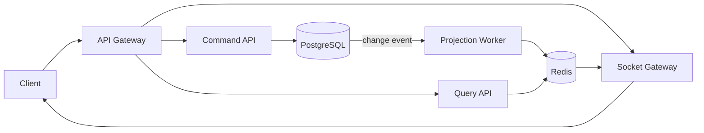
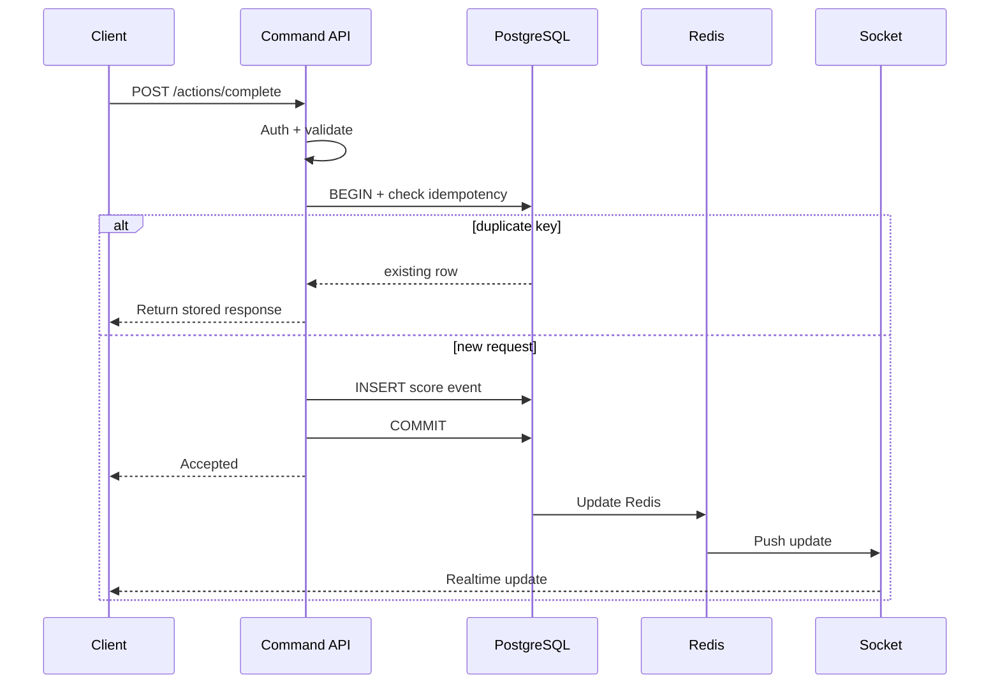
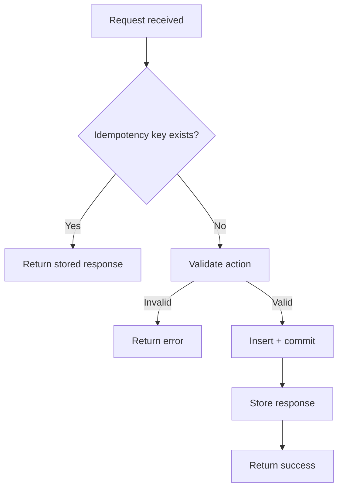
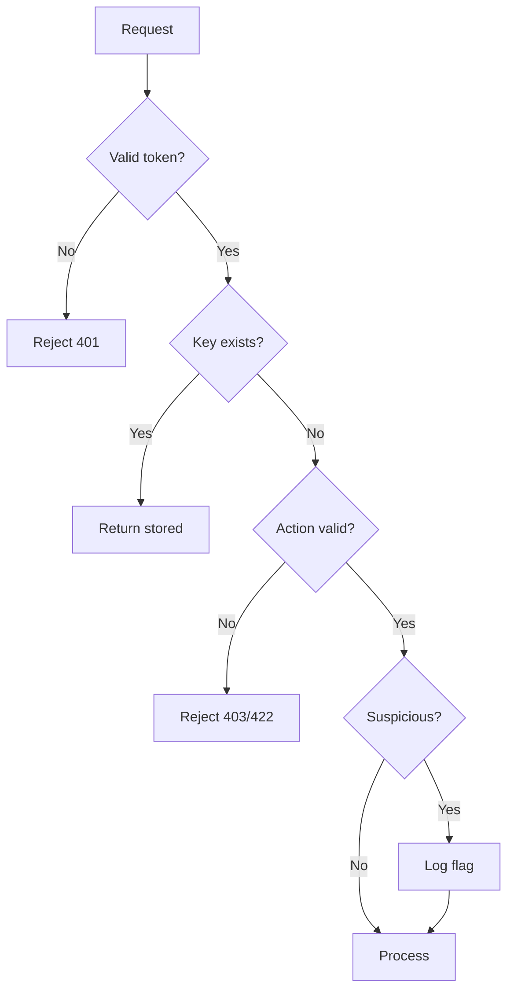

# Problem 6: Live Scoreboard API Module

## 1. Overview

This document specifies a backend API module that provides live top-10 scoreboard functionality. The module handles score persistence, leaderboard queries, and real-time update delivery to connected clients.

### 1.1 Core Responsibilities

- Persist and update user scores upon action completion
- Serve top-10 leaderboard data for display
- Push leaderboard changes to clients via WebSocket in real-time
- Prevent unauthorized or malicious score manipulation

### 1.2 Scope Definition

**In Scope:**
- Score update endpoint (`POST /actions/complete`)
- Real-time leaderboard updates via WebSocket
- Top-10 query endpoint (`GET /leaderboard`)
- Authentication, authorization, and abuse prevention controls

**Out of Scope:**
- Definition of user actions (the triggering event is not specified here)
- Frontend UI behavior and presentation
- User profile management

---

## 2. Architecture

### 2.1 Design Pattern: CQRS

This module implements Command Query Responsibility Segregation (CQRS). The pattern separates write operations (commands) from read operations (queries) to optimize each for different requirements.

**Command Side:** Handles score update requests. Writes go to PostgreSQL as the source of truth.

**Query Side:** Handles leaderboard read requests. Reads are served from Redis cache for low latency.

**Synchronization:** A projection worker consumes change events from PostgreSQL and updates the Redis read model.

### 2.2 System Architecture



### 2.3 Component Responsibilities

| Component | Responsibility |
|-----------|---------------|
| API Gateway | Request routing, TLS termination, rate limiting |
| Command API | Authentication, validation, score writes |
| Query API | Leaderboard read requests |
| Projection Worker | Sync PostgreSQL changes to Redis |
| Socket Gateway | Real-time update fanout to clients |
| PostgreSQL | Source of truth for all data |
| Redis | Cached leaderboard data for fast reads |

### 2.4 Data Flow

1. **Write Path:** `POST /actions/complete` → Command API → PostgreSQL
2. **Sync Path:** PostgreSQL → Projection Worker → Redis
3. **Read Path:** `GET /leaderboard` → Query API → Redis
4. **Realtime Path:** Redis change → Socket Gateway → Client

PostgreSQL serves as the authoritative data store. Redis is a derived cache that can be rebuilt from PostgreSQL if necessary.

---

## 3. Functional Specification

### 3.1 Requirements

1. The system shall display the top 10 users ranked by score
2. The leaderboard shall update automatically without user intervention
3. Completing an action shall trigger a score increase via API call
4. The system shall reject unauthorized or malicious score updates

### 3.2 API Endpoints

#### 3.2.1 POST /actions/complete

Submits a completed action and updates the user's score.

**Request Body:**
```json
{
  "actionId": "daily-login",
  "idempotencyKey": "uuid",
  "clientTimestamp": "2026-04-17T11:12:03Z"
}
```

**Success Response (200):**
```json
{
  "requestId": "uuid",
  "userId": "user-123",
  "scoreDelta": 50,
  "newTotalScore": 1500,
  "acceptedAt": "2026-04-17T11:12:03Z"
}
```

**Error Responses:**
- 400 — Invalid request payload
- 401 — Missing or invalid authentication
- 409 — Duplicate request (idempotency key already processed)
- 429 — Rate limit exceeded

#### 3.2.2 GET /leaderboard

Retrieves the current top scorers.

**Query Parameters:**
- `limit` — Number of results (default: 10, maximum: 100)

**Success Response (200):**
```json
{
  "generatedAt": "2026-04-17T11:12:03Z",
  "items": [
    { "rank": 1, "userId": "user-742", "displayName": "Sam", "score": 21250 }
  ]
}
```

#### 3.2.3 WSS /leaderboard/live

WebSocket endpoint for real-time leaderboard updates.

**Server Push Event:**
```json
{
  "event": "leaderboard:update",
  "data": {
    "items": [
      { "rank": 1, "userId": "user-742", "displayName": "Sam", "score": 21250 }
    ]
  }
}
```

---

## 4. Write Flow



**Key Observations:**

1. **Idempotency:** Every request includes an idempotency key that prevents duplicate processing. Client retries return the original response without re-processing.

2. **Durability:** Score events are written to PostgreSQL first, ensuring durability before any cache update occurs.

3. **Eventual Consistency:** Redis is updated after the PostgreSQL commit. The cache may briefly lag behind the authoritative data.

---

## 5. Idempotency Mechanism



The idempotency constraint ensures that client retry attempts do not result in duplicate score awards.

---

## 6. Security

### 6.1 Authentication and Authorization

| Control | Implementation |
|---------|---------------|
| Authentication | JWT Bearer token with 15-60 minute expiry |
| Authorization | User identity verified on every request; users may only modify their own scores |
| Token Validation | Signature, expiry, and audience claims verified |
| Account Status | Suspended users receive 403 Forbidden |

### 6.2 Abuse Prevention

| Control | Description |
|---------|-------------|
| Idempotency | Unique constraint on `(user_id, idempotency_key)` prevents duplicate scoring |
| Rate Limiting | Per-user: 10 score updates/minute; Per-IP: 100 requests/minute |
| Server-side Scoring | `scoreDelta` is derived from `actionId` on the server; client values are ignored |
| Timestamp Validation | `clientTimestamp` must fall within a 5-minute skew window |
| Fraud Monitoring | Per-user action frequency tracked; anomalies flagged for review |

### 6.3 Fraud Detection



**Monitored Signals:**
- Action frequency per user (velocity spike detection)
- Multiple accounts from the same IP address
- Repeated action completion within an abnormally short interval
- Score increments that deviate significantly from established patterns

---

## 7. Data Model

### 7.1 PostgreSQL Schema

| Table | Fields | Purpose |
|-------|--------|---------|
| users | id, email, nick_name, score (BIGINT), status, created_at, updated_at | User accounts and current scores |
| score_events | id, user_id, action_id, score_delta, occurred_at | Append-only audit log of all score changes |
| idempotency_keys | user_id, key, response_body, created_at | Stores processed request responses for deduplication |

**Implementation Note:** The `score_events` table is append-only. No UPDATE or DELETE operations are permitted on this table, as it serves as the authoritative audit trail.

### 7.2 Redis Schema

| Key | Type | Purpose |
|-----|------|---------|
| leaderboard:global | Sorted Set | Global ranking by score (ZINCRBY for updates) |
| user:score:{userId} | String | Per-user score snapshot |

---

## 8. Error Handling

### 8.1 Error Response Format

```json
{
  "error": {
    "code": "ERROR_CODE",
    "message": "Human-readable description",
    "requestId": "uuid"
  }
}
```

### 8.2 Error Codes

| Code | HTTP Status | Description |
|------|-------------|-------------|
| INVALID_TOKEN | 401 | Missing or invalid authentication token |
| FORBIDDEN | 403 | User not authorized for this operation |
| INVALID_PAYLOAD | 400 | Request body validation failed |
| DUPLICATE_ACTION | 409 | Idempotency key already processed with different payload |
| RATE_LIMITED | 429 | Request rate limit exceeded |

---

## 9. Non-Functional Requirements

### 9.1 Performance Targets

| Metric | Target |
|--------|--------|
| Read latency (p95) | < 100ms |
| Write latency (p95) | < 200ms |
| Realtime update delivery | < 1 second from commit |

### 9.2 Scalability Targets

| Resource | Capacity |
|----------|----------|
| Write throughput | 1,000 score updates/second (burst) |
| Read throughput | 10,000 leaderboard queries/second |
| WebSocket connections | 50,000 concurrent |

---

## 10. Scaling Architecture

### 10.1 Horizontal Scaling Strategy

| Component | Scaling Approach |
|-----------|-----------------|
| Command API | Stateless; scale horizontally behind load balancer |
| Query API | Stateless; scale horizontally behind load balancer |
| Projection Worker | Add consumer instances to increase event processing throughput |
| Socket Gateway | Stateful; use Redis pub/sub adapter for multi-node deployments |
| PostgreSQL | Read replicas for Query API; primary for Command API writes |
| Redis | Redis Cluster for horizontal cache scaling |

### 10.2 Concurrency Handling

- **Idempotency keys** serve as the primary defense against race conditions and duplicate processing
- **PostgreSQL transactions** with row-level locking ensure atomic score updates
- **At-least-once delivery** with consumer-side deduplication by `event_id`

### 10.3 Failure Recovery

| Failure Scenario | Recovery Procedure |
|-----------------|-------------------|
| Redis cache loss | Rebuild from `score_events` table via backfill job |
| Projection worker failure | Events queue in message broker; resume on worker restart |
| API instance crash | Client retries with same idempotency key; stored response returned |
| PostgreSQL primary failure | Failover to read replica; promote replica to primary |

---

## 11. Implementation Guidelines

### 11.1 Recommended Technology Stack

- **Database:** PostgreSQL with PgBouncer connection pooling
- **Cache:** Redis with sorted set operations for leaderboard ranking
- **Message Queue:** PostgreSQL outbox table with CDC or direct worker
- **WebSocket:** Socket.IO or native WebSocket with Redis adapter

### 11.2 Critical Implementation Notes

1. Use `BIGINT` for all score fields to prevent overflow at high values
2. Maintain append-only semantics for `score_events` table
3. Create index on `(score DESC, updated_at ASC)` for efficient leaderboard queries
4. Batch Redis updates in projection worker to reduce write pressure
5. Emit WebSocket updates only when the visible top-10 changes, not on every score update

### 11.3 Observability Requirements

The following should be logged for operational monitoring and debugging:

- All rejected requests with reason, userId, and IP address
- Projection lag (time between PostgreSQL commit and Redis update)
- WebSocket delivery latency

---

## 12. Future Considerations

The following enhancements are out of scope for the initial implementation but may be considered for future phases:

- Scoped leaderboards (daily, weekly, monthly resets)
- Administrative interface for score corrections
- Multi-region socket fanout for global user base
- Advanced fraud detection with machine learning
